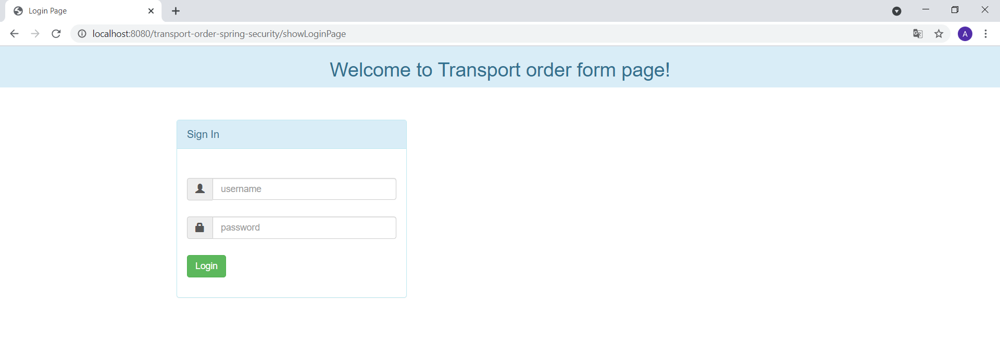
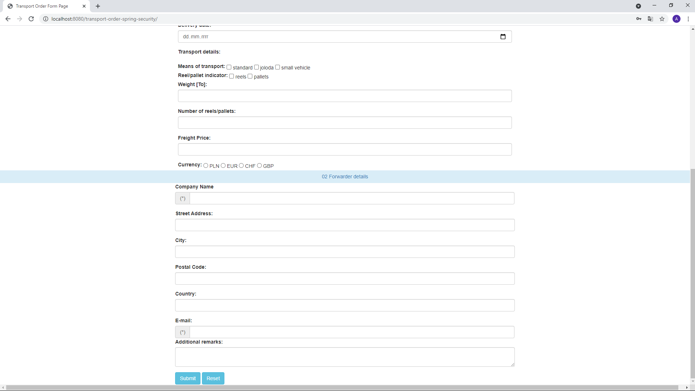
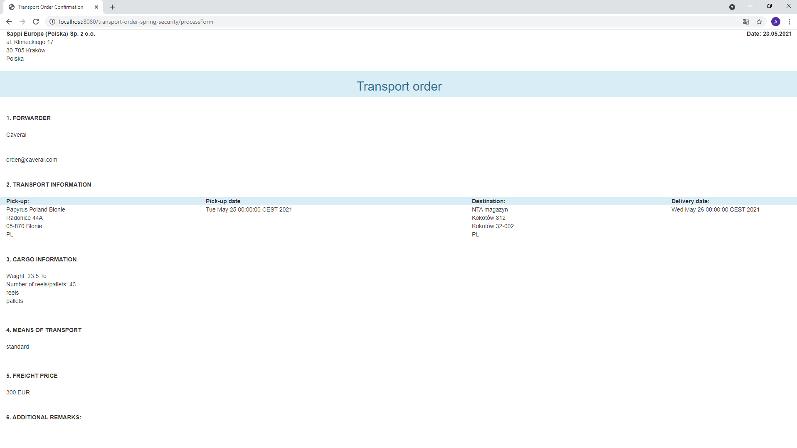

# Transport order form
***
This is a web application using Spring Security and Bootstrap. It has been built using Maven.

## Table of Contents
* [General Info](#general-information)
* [Features](#features)
* [Technologies Used](#technologies-used)
* [Setup](#setup)
* [Project Status](#project-status)

## General Information 
The project was created to enable creating transport orders outside ERP software. It has been inspired by current work environment.

## Features 
This project includes:
- Login page
- Form page
- Displaying data retrieved from the form as a transport order

|  form            |  form |
|---------------------|----------------------|
| ||

Transport order confirmation

## Technologies Used
- Java - version 15.0.1.0
- Spring - version 5.0.2. Release
- Spring Security - version 5.0.0. Release
- Hibernate-validator - version 6.1.6.Final
- Bootstrap 3
- JSP
- Javax.servlet - version 3.1.0
- Maven
- Tomcat - version 9.0

## Setup

###### 1. Clone this reposidory to your desktop

###### 2. Import project into Eclipse (recommended)

To use Maven in the Eclipse environment at all, you must first download the appropriate plug-in. It is called [m2e](https://www.eclipse.org/m2e/) and is also available through the [Eclipse Marketplace](https://marketplace.eclipse.org/content/maven-integration-eclipse-luna-and-newer).

In Eclipse, go to the File menu and choose:
     `File -> Import... -> Existing Maven Projects into Workspace`
     `Select the directory containing this file.`
     `Click Finish.`

All the dependencies you will be able to build from the pom.xml in this directory.

If you need more information please take a look at this [quick tutorial](https://maven.apache.org/guides/getting-started/maven-in-five-minutes.html).
     

###### 3. Install and Configure Web Server
[Setup and Install Apache Tomcat Server in Eclipse Development Environment](https://crunchify.com/step-by-step-guide-to-setup-and-install-apache-tomcat-server-in-eclipse-development-environment-ide/)

## Project Status
Project is complete.

